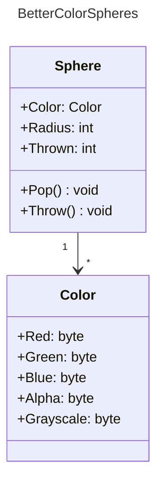

```mermaid
---
title: BetterColorSpheres
---
    classDiagram
        Sphere "1" --> "*" Color
        class Sphere{
            +Color: Color
            +Radius: int
            +Thrown: int

            +Pop() void
            +Throw() void
        }
        class Color{
            +Red: byte
            +Green: byte
            +Blue: byte
            +Alpha: byte
            +Grayscale: byte
        }
```